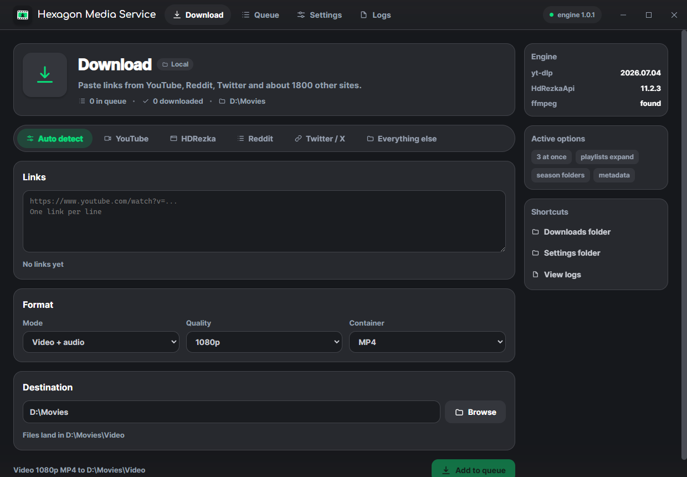

# Hexagon Media Service

A private desktop downloader for YouTube, HDRezka, Reddit, Twitter/X and roughly
1800 other sites. Everything runs locally: no account, no telemetry, no upload.
Built because online converter sites are slow, ad-ridden and untrustworthy.

**[simplefoxofficial.github.io/Hexagon-Media-Service](https://simplefoxofficial.github.io/Hexagon-Media-Service/)**
- downloads, screenshots and the short version.



## What it does

- **A tab per service.** Auto detect, YouTube, HDRezka, Reddit, Twitter/X and
  everything else. HDRezka gets a panel of its own, because picking a dub and a
  spread of episodes has nothing in common with pasting a link.
- **HDRezka in bulk.** Load a title, then pick the translation (dub), the
  quality, and any mix of seasons and episodes: select all, a whole season, or a
  range like `1-10` or `3,5,7`.
- **Series get filed properly.** A season downloads as
  `Show / Season 06 / Show 6x20 Dub.mp4`, and the panel previews the exact path
  before anything is queued.
- **Many sources.** Anything yt-dlp supports, plus a dedicated HDRezka resolver.
- **Many ways.** Video with audio, audio only, or video only. Quality from 360p
  to 4K. MP4, MKV or WEBM containers; MP3, M4A, Opus, FLAC, WAV or Vorbis audio
  at a chosen bitrate.
- **Bulk.** Paste many links at once, or drop in a playlist or channel URL and
  have every entry expand into its own queue item.
- **Metadata.** Title, artist, album, date, chapters, subtitles and cover art
  are embedded into the finished file. Source URL and download date are written
  as extra tags on top of what ffmpeg produces.
- **Organised output.** Optional per-media-type and per-site sub-folders, plus a
  configurable yt-dlp filename template.
- **A real queue.** Concurrent downloads with pause, resume, retry, live speed
  and ETA, and a per-item error that says what actually went wrong.
- **Updates itself.** The app checks GitHub for a new release, shows the notes,
  and installs it on request: the download is verified against the checksum
  published beside it, and the app reopens on the new version. It also shows
  what changed the first time a new version starts. The check is one request on
  launch and can be turned off in Settings; nothing is downloaded until asked.

## Shape of the thing

Three pieces, three languages, one window.

| Piece | Lives in | Job |
| --- | --- | --- |
| Shell | `desktop/` | Electron. The window and the whole interface. |
| Engine | `mediadl/` | Python. yt-dlp, tagging, file filing. Headless. |
| Extension | `extension/` | Chrome MV3. Reads HDRezka pages. Only used there. |

The shell spawns the engine and talks newline-delimited JSON over stdio. The
engine also runs a token-protected HTTP server on 127.0.0.1 that the extension
talks to. Only the interface is web technology; all downloading is Python.

The renderer is plain ES modules - no bundler, no framework. Job rows are
patched in place, so a running download does not re-render the window every
tick.

## Installing

Grab the installer from the
[releases page](https://github.com/SimpleFoxOfficial/Hexagon-Media-Service/releases)
and run it. The download engine and ffmpeg are both bundled, so Python is not
needed.

There is also a portable build. It cannot update itself - a running exe cannot
overwrite its own file on Windows - so it links to the release page instead.

HDRezka additionally needs the browser extension; the installer offers to open
its folder on the finish page. Load that folder at `chrome://extensions` with
**Developer mode** on, then pair it from **Download > HDRezka** in the app.

## Running from source

Requires Python 3.10+, Node 18+, and ffmpeg on `PATH`.

```bash
python -m pip install -r requirements.txt
```

```bash
cd desktop && npm install
```

```bash
cd desktop && npm start
```

The window opens and the engine starts automatically as a child process; never
launch it separately. Add `-- --dev` to open devtools.

## Building

Two steps: freeze the engine, then package the shell around it.

```bash
python -m PyInstaller Engine.spec --noconfirm --distpath dist-engine --workpath build-engine
```

```bash
cd desktop && npx --no-install electron-builder --win
```

Both artefacts land in `build-output/`: an installer, a portable exe, and the
`latest.yml` the updater checks a download against. Attach all three to a
release tagged `v<version>`.

| Command | Output |
| --- | --- |
| `python -m PyInstaller Engine.spec ...` | `dist-engine\mediadl-engine.exe` |
| `npx electron-builder --win` | `build-output\` installer and portable |
| `python tools/make_icon.py` | `mediadl\resources\app.ico` |
| `python tools/make_manual.py` | `docs\Hexagon-Media-Service-Manual.pdf` |
| `python tools/stage_ffmpeg.py` | `vendor\ffmpeg\` |

The version comes from `desktop/package.json`; `mediadl/__init__.py` carries the
engine's own and the two are kept in step.

## Settings

The panel covers what most people change: theme and accent, simultaneous
downloads, speed limit, playlist expansion, season folders, metadata embedding,
which browser to take cookies from, and updates.

The engine understands a good deal more than the panel exposes - audio codec and
bitrate, per-site sub-folders, filename and episode templates, subtitle
languages, proxy, retries, a download archive. Those live in `settings.json` and
are read on start. Settings load forgivingly: unknown keys are dropped and
malformed values fall back to defaults, so a file written by another build will
never stop the app from starting.

## When something fails

The **Logs** tab shows what the app and yt-dlp actually did, and can copy the
whole buffer or open the folder holding the rotating log file. Failures in the
queue carry a plain-language explanation rather than only the raw error.

Three failures are worth knowing about in advance.

**HDRezka answers with an anti-bot page.** It returns HTTP 200 with a short
"checking that you are not a bot" body, so nothing can be parsed from it. This
is exactly why the extension exists: your browser has already passed that check,
so the page is read there and handed to the app. Nothing here tries to solve it
programmatically.

**YouTube returns 403 partway through a large download.** YouTube forces SABR
streaming, and asking for a specific container during selection steers it onto
clients that drop the transfer. Selection is by resolution only and the
container is produced by remuxing afterwards, which avoids it; downloads are
also chunked so an expiring URL does not kill a multi-gigabyte transfer.

**Cookies from a running Chrome cannot be read.** Chrome holds an exclusive lock
on its cookie database. The app resolves cookies once into a file and carries on
with a warning rather than failing the download.

## Keeping it working

Sites change their players constantly, so **yt-dlp goes stale fast**. When a
download fails with `Requested format is not available` on a video that plays
fine in a browser, that is almost always the cause:

```bash
python -m pip install --upgrade yt-dlp
```

Then rebuild the engine. **Settings > About** shows the version in use.

## Where things live

| What | Where |
| --- | --- |
| Settings | `%APPDATA%\HexagonMediaService\settings.json` |
| History | `%APPDATA%\HexagonMediaService\history.json` |
| Update state and changelog | `%APPDATA%\HexagonMediaService\updates.json` |
| Extension pairing token | `%APPDATA%\HexagonMediaService\bridge-token.txt` |
| Log file | `%APPDATA%\HexagonMediaService\mediadl.log` |
| Browser staging | `Downloads\MediaDownloader\` |
| Downloads | your Downloads folder, unless changed |

The folder is migrated from the older `MediaDownloader` name on first run, so an
upgrade keeps its settings, history and pairing token.

Files fetched by the browser for HDRezka land in the staging folder first, then
the app moves them to the real destination. Chrome refuses to write anywhere
else; the staging folder is a waypoint, not a leftover.

## Layout

```
desktop/
  src/main/       Electron main: window, engine bridge, updater
  src/preload/    the only surface the renderer gets
  src/renderer/   plain ES modules, no bundler
  installer/      NSIS customisation
mediadl/
  daemon.py       the JSON-over-stdio protocol
  config.py       typed settings, JSON persistence
  paths.py        appdata, resources, ffmpeg discovery
  bridge_server.py  token-protected 127.0.0.1 server for the extension
  core/
    job.py        Job model and states
    presets.py    preset -> yt-dlp options
    engine.py     URL expansion and the download worker
    manager.py    queue, concurrency, history
    metadata.py   mutagen tagging
    filing.py     verified moves through the Win32 copy API
    text.py       repairs mis-decoded dub names
    sources/      resolver registry (generic + HDRezka)
extension/        Chrome MV3, HDRezka only
docs/             the project page, served by GitHub Pages, and the manual
tools/            icon, manual and ffmpeg staging scripts
```

`run.py`, `build.ps1`, `MediaDownloader.spec` and `mediadl/ui/` belong to the
retired PySide6 interface. They still import but are not part of the app.

## The window

It draws its own titlebar, so the window controls sit at the right of the top
bar. Drag the empty strip to move it, double-click to maximise, `F11` toggles
fullscreen and `Esc` leaves it.

## Fonts

Body text is Inter, falling back to Segoe UI. The wordmark is Comfortaa, bundled
in `desktop/src/renderer/fonts/` under the SIL Open Font License 1.1 with its
licence text alongside, so it packs into the asar and resolves identically in
development and in the installed app.

## Built on

[yt-dlp](https://github.com/yt-dlp/yt-dlp) for extraction,
[HdRezkaApi](https://github.com/SuperZombi/HdRezkaApi) for HDRezka,
[mutagen](https://github.com/quodlibet/mutagen) for tagging,
[Electron](https://www.electronjs.org/) for the window, and ffmpeg for muxing
and conversion.

Download only what you have the right to download.
