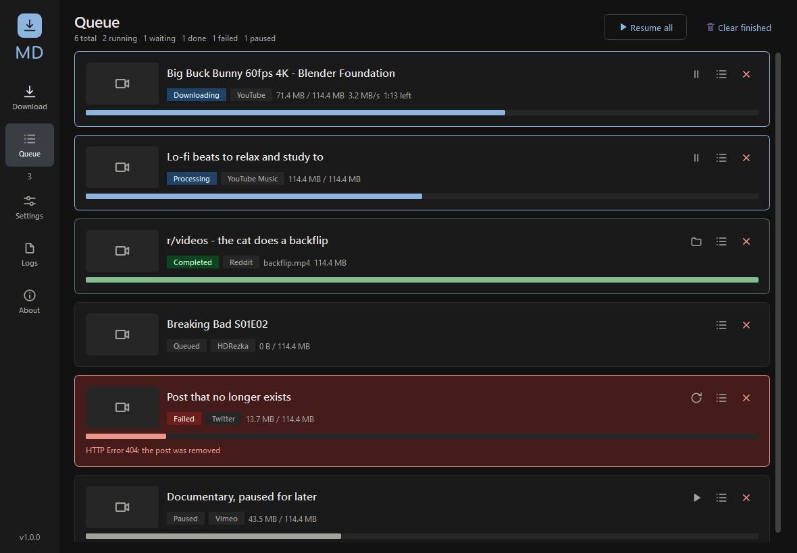

# Media Downloader

A private desktop downloader for YouTube, HDRezka, Reddit, Twitter/X and roughly
1800 other sites. Everything runs locally: no account, no telemetry, no upload.
Built because online converter sites are slow, ad-ridden and untrustworthy.



## What it does

- **A tab per service.** Auto detect, YouTube and HDRezka each get their own
  panel, because they do not need the same options. Paste an HDRezka link into
  Auto and it hands off to the HDRezka tab by itself.
- **HDRezka in bulk.** Load a title, then pick the translation (dub), the
  quality, and any mix of seasons and episodes: All, Latest season, or a range
  like `1-10` or `3,5,7`. Subtitles and tagging are per-title switches.
- **Series get filed properly.** A season downloads as
  `Show / Season 06 / Show - S06E20.mp4`, and the panel previews the exact path
  before anything is queued.
- **Many sources.** Anything yt-dlp supports, plus a dedicated HDRezka resolver.
- **Many ways.** Video with audio, audio only, or video only. Quality from 360p
  to 4K. MP4, MKV or WEBM containers; MP3, M4A, Opus, FLAC, WAV or Vorbis audio
  at a chosen bitrate.
- **Bulk.** Paste many links at once, import a `.txt` list, or drop in a
  playlist or channel URL and have every entry expand into its own queue item.
- **Metadata.** Title, artist, album, date, chapters, subtitles and cover art
  are embedded into the finished file. Source URL and download date are written
  as extra tags on top of what ffmpeg produces.
- **Organised output.** Optional per-media-type and per-site sub-folders, plus a
  configurable yt-dlp filename template.
- **A real queue.** Concurrent downloads with pause, resume, retry, per-item
  logs, speed and ETA.

## Look and feel

Two design languages, switchable in Settings:

- **Studio** (default) matches the sibling Modpack-Utility app: flat neutral
  surfaces, muted accents, 7px radii, thin dividers and progress bars.
- **Vibrant** is the saturated Material 3 treatment, with pill buttons and
  tonal containers.

Either way the whole scheme is generated at runtime from one seed colour. Tonal
palettes are computed in OkLCh and gamut-mapped per tone, so any accent stays
legible in both light and dark. Body text is Segoe UI; the logo is Comfortaa.

Also adjustable: theme mode (including following Windows), accent colour, corner
rounding, comfortable or compact density, text size, interface font, animations
and queue thumbnails.

## When something fails

The **Logs** tab shows what the app and yt-dlp actually did, filterable by level
and text, with a verbose switch. The same stream goes to
`%APPDATA%\MediaDownloader\mediadl.log`, which rotates. Failures in the queue
carry a plain-language explanation rather than only the raw error.

Two failures are worth knowing about in advance:

**HDRezka answers with an anti-bot page.** It returns HTTP 200 with a short
"checking that you are not a bot" body, so nothing can be parsed from it. Open
the title in your browser, let its check pass, then set
**Settings > Network > Use cookies from** to that browser; those cookies are
reused for HDRezka. There is no way around the check itself. A mirror host can
also be set in Settings > Advanced.

**YouTube returns 403 partway through a large download.** YouTube forces SABR
streaming, and asking for a specific container during selection steers it onto
clients that drop the transfer. Selection is by resolution only and the
container is produced by remuxing afterwards, which avoids it; downloads are
also chunked so an expiring URL does not kill a multi-gigabyte transfer, and a
403 is retried with a fresh URL, resuming from the partial file.

## Running it

**From the executable**

Grab `dist\MediaDownloader.exe` and double-click it. Nothing to install.

**From source**

```bash
python -m pip install -r requirements.txt
```

```bash
python run.py
```

Requires Python 3.10+ and ffmpeg on `PATH` (or set its location in Settings).
ffmpeg is needed to merge video with audio and to convert audio formats.

## Building the executable

```bash
powershell -ExecutionPolicy Bypass -File .\build.ps1
```

Produces a single `dist\MediaDownloader.exe`, around 56 MB.

| Flag | Effect |
| --- | --- |
| `-OneDir` | Folder build instead of one file. Starts faster. |
| `-WithFfmpeg` | Copies `ffmpeg.exe` from `PATH` into the bundle. |
| `-SkipIcon` | Reuses the existing `app.ico`. |

To change the app icon, edit the logo and run `python tools/make_icon.py`.

> If PyInstaller fails, check whether you are on the Microsoft Store build of
> Python. It installs into a sandboxed location that PyInstaller cannot always
> read. Installing Python from python.org resolves it. The build script warns
> about this up front.

## Keeping it working

Sites change their players constantly, so **yt-dlp goes stale fast**. When a
download fails with `Requested format is not available` on a video that plays
fine in a browser, that is almost always the cause:

```bash
python -m pip install --upgrade yt-dlp
```

Then rebuild the exe. The About screen shows the bundled yt-dlp version.

## Fonts

Body text is Segoe UI, which ships with Windows. The logo is Comfortaa, bundled
in `mediadl/resources/fonts/` under the SIL Open Font License 1.1 with its
licence text alongside.

Any other `.ttf` or `.otf` dropped in that folder is registered at startup. If
the Comfortaa file is removed the logo falls back to the interface font and
nothing else changes; Settings reports which is in use.

## Where things live

| What | Where |
| --- | --- |
| Settings | `%APPDATA%\MediaDownloader\settings.json` |
| History | `%APPDATA%\MediaDownloader\history.json` |
| Download archive | `%APPDATA%\MediaDownloader\download-archive.txt` |
| Downloads | your Downloads folder, unless changed |

Settings are written atomically and load forgivingly: unknown keys are dropped
and malformed values fall back to defaults, so a settings file from a different
build will not stop the app from starting.

## Layout

```
mediadl/
  app.py              application bootstrap
  config.py           typed settings, JSON persistence
  paths.py            appdata, resources, ffmpeg discovery
  core/
    job.py            Job model and states
    presets.py        preset -> yt-dlp options
    engine.py         URL expansion and the download worker
    manager.py        queue, concurrency, history
    metadata.py       mutagen tagging
    sources/          resolver registry (generic + HDRezka)
  ui/
    color.py          OkLab/OkLCh maths, tonal palettes
    theme.py          Material 3 schemes and the Qt style sheet
    icons.py          vector icon set
    widgets.py        cards, switches, chips, thumbnails, toasts
    views/            download, queue, settings, about
    dialogs/          HDRezka series picker
tools/make_icon.py    generates app.ico from the logo
```

Downloads run on a `QThreadPool`. Workers never touch widgets; they emit Qt
signals which cross to the GUI thread as queued connections.

## Keyboard

| Keys | Action |
| --- | --- |
| `Ctrl+1` / `Ctrl+2` | Download / Queue |
| `Ctrl+,` | Settings |
| `Ctrl+V` | Paste links into the input |
| `Ctrl+Enter` | Add to queue |

You can also pass links straight to the executable:

```bash
MediaDownloader.exe "https://www.youtube.com/watch?v=..."
```

## Built on

[yt-dlp](https://github.com/yt-dlp/yt-dlp) for extraction,
[HdRezkaApi](https://github.com/SuperZombi/HdRezkaApi) for HDRezka,
[mutagen](https://github.com/quodlibet/mutagen) for tagging,
[PySide6](https://doc.qt.io/qtforpython-6/) for the interface, and ffmpeg for
muxing and conversion.

Download only what you have the right to download.
